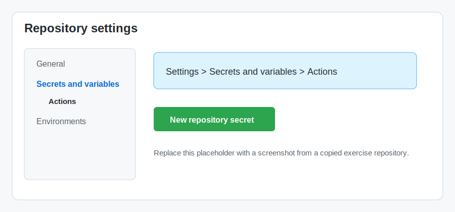
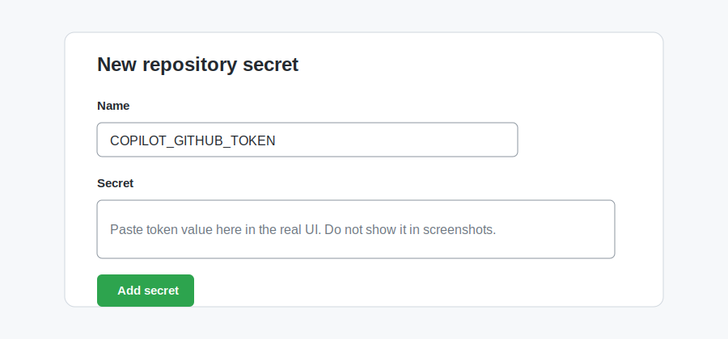

## Step 1: Install agentic workflows and merge the setup

Mona's website needs repository-level setup before an agentic workflow can help. In this step, you'll add the GitHub Agentic Workflows setup workflow and merge it to `main`.

### 📖 Theory: What are Agentic Workflows?

[**Agentic workflows**](https://github.github.com/gh-aw/introduction/overview/) are AI-powered automation that can understand context, make decisions, and take meaningful actions—all from natural language instructions you write in markdown.

Unlike traditional automation with fixed if-then rules, agentic workflows use coding agents (like Copilot CLI, Claude, or Codex) to:

- **Understand context**: Read your repository, issues, and pull requests to grasp the current situation.
- **Make decisions**: Choose appropriate actions based on the context, not just predefined conditions.
- **Adapt behavior**: Respond flexibly to different scenarios without requiring explicit programming for each case.

You describe what you want to happen in a markdown file with a YAML frontmatter trigger. The `gh aw compile` command turns that markdown into a hardened GitHub Actions workflow (`.lock.yml`) that runs an AI agent in a containerized environment. Workflows are read-only by default, and write operations are only allowed through sanitized [`safe-outputs`](https://github.github.com/gh-aw/reference/safe-outputs/) such as creating issues, comments, and pull requests—so AI agents stay within controlled boundaries.

### 📖 Theory: Setting Up a Repository for Agentic Workflows

GitHub Agentic Workflows use repository files and GitHub Actions to give AI agents a safe, repeatable place to work. A setup workflow can install the `gh aw` tooling for GitHub Actions so future workflows can create or maintain automation in this repository.

The [`gh aw` CLI](https://github.github.com/gh-aw/setup/cli/) and setup action are commonly used to prepare a repository for agentic workflows. In this exercise, you'll add the repository setup as code, review it in a pull request, and then merge it to `main`.

### :keyboard: Activity: Set up your Codespace and agentic workflow tooling

Let's start in the pre-configured Codespace for this exercise. The dev container installs the website dependencies, the GitHub CLI, Copilot CLI, the GitHub Copilot extensions for VS Code, and opens a terminal in the editor. You'll install the Agentic Workflows CLI yourself in the first activity.

1. Use the button below to open the **Create Codespace** page in a new tab. Use the default configuration.

   [](https://codespaces.new/{{full_repo_name}}?quickstart=1)

2. Confirm the **Repository** field is your copy of the exercise, not the original template, then click the green **Create Codespace** button.
   - ✅ Your copy: `/{{full_repo_name}}`
   - ❌ Original: `/skills-dev/getting-started-with-agentic-workflows`

3. Wait for Visual Studio Code to load in your browser. The `.devcontainer` setup may take a few minutes while it installs dependencies and verifies the Astro site build.

4. In the terminal that opened in the editor, run the official standalone installer to install or update the GitHub Agentic Workflows CLI extension.

   ```bash
   curl -sL https://raw.githubusercontent.com/github/gh-aw/main/install-gh-aw.sh | bash
   ```

   This standalone installer is the easiest path in Codespaces because it does not depend on interactive `gh extension install` authentication.

5. Set up the `COPILOT_GITHUB_TOKEN` repository secret that the Copilot engine will use later in the exercise.

   This exercise is designed for **public** repository copies. If you copied the exercise as a private repository, token setup may require additional account or organization policy configuration.

   1. [Create a fine-grained personal access token](https://github.com/settings/personal-access-tokens/new?name=COPILOT_GITHUB_TOKEN&description=GitHub+Agentic+Workflows+-+Copilot+engine+authentication&user_copilot_requests=read) with **Copilot Requests** set to **Read**.
   2. Copy the token value.
   3. In your copied exercise repository, go to **Settings** > **Secrets and variables** > **Actions**.
   4. Select **New repository secret**.
   5. Name the secret `COPILOT_GITHUB_TOKEN`, paste the token value, and save it.

   

   

   > [!CAUTION]
   > Never paste a real token into a comment, markdown file, pull request, or Copilot Chat message. Only add it through the repository secrets UI.

6. Open Copilot Chat and switch to **Agent** mode.

7. Ask Copilot to create the setup workflow for you.

   > 
   >
   > ```prompt
   > Create a new branch named install-agentic-workflows.
   > Add .github/workflows/copilot-setup-steps.yml with a workflow named "Copilot Setup Steps".
   > The workflow should run on workflow_dispatch and when .github/workflows/copilot-setup-steps.yml changes.
   > Add a job named copilot-setup-steps that runs on ubuntu-latest, checks out the repository, and installs the gh-aw CLI using github/gh-aw/actions/setup-cli@main.
   > ```

8. Review Copilot's suggested changes. The finished file should look similar to this:

   ```yaml
   name: "Copilot Setup Steps"

   on:
     workflow_dispatch:
     push:
       paths:
         - .github/workflows/copilot-setup-steps.yml

   jobs:
     copilot-setup-steps:
       runs-on: ubuntu-latest
       permissions:
         contents: read
       steps:
         - name: Checkout repository
           uses: actions/checkout@v6
         - name: Install gh-aw extension
           uses: github/gh-aw/actions/setup-cli@main
   ```

9. Ask Copilot to commit, push, and open a pull request.

   > 
   >
   > ```prompt
   > Commit the setup workflow change, push the install-agentic-workflows branch, and open a pull request into main.
   > Use the pull request title "Add Copilot setup workflow".
   > ```

10. Merge the pull request into `main`.

11. Wait about 20 seconds, then refresh the exercise issue for the next step.

<details>
<summary>Having trouble? 🤷</summary><br/>

- Make sure the file path is exactly `.github/workflows/copilot-setup-steps.yml`.
- The check looks for the `copilot-setup-steps` job and the `github/gh-aw/actions/setup-cli` action.
- Make sure `COPILOT_GITHUB_TOKEN` is a repository Actions secret, not a value committed to the repository.
- Step 1 only completes after your setup pull request is merged into `main`.

</details>
