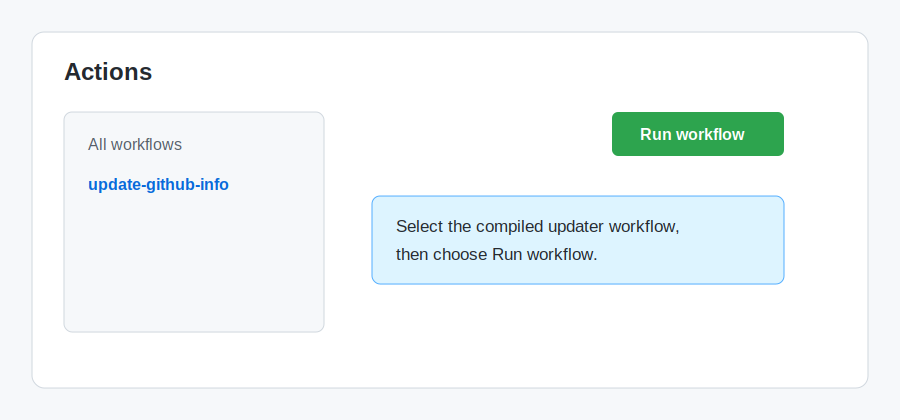
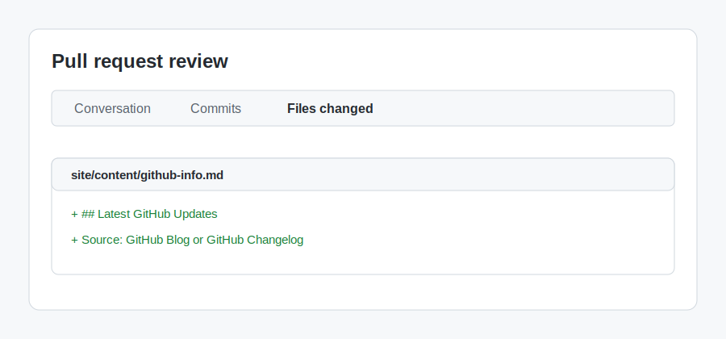

## Step 3: Run Mona's updater and review the generated pull request

You now have an agentic workflow definition for Mona's website. In this step, you'll run it and inspect the pull request it creates.

### 📖 Theory: From workflow definition to generated pull request

Agentic workflows are authored as markdown files, but GitHub Actions runs compiled `.lock.yml` workflow files. The `gh aw compile` command turns `.github/workflows/update-github-info.md` into `.github/workflows/update-github-info.lock.yml`.

Because this workflow uses the default Copilot engine, it needs the `COPILOT_GITHUB_TOKEN` Actions secret you added in Step 1 before the compiled workflow can run.

The workflow uses `safe-outputs: create-pull-request`, so the agent can draft website changes without writing directly to `main`. The agent prepares a patch, and a separate permission-controlled job opens a pull request for Mona to review.

### :keyboard: Activity: Run the updater and inspect its pull request

1. Confirm the repository still has the `COPILOT_GITHUB_TOKEN` Actions secret from Step 1.

   If you need to check, go to **Settings** > **Secrets and variables** > **Actions** in your copied exercise repository. You should see `COPILOT_GITHUB_TOKEN` listed as a repository secret.

2. Ask Copilot to compile and run Mona's updater.

   > 
   >
   > ```prompt
   > - Check that gh-aw is available in this repository.
   > - Make sure I am on the latest main branch before changing files.
   > - Update notes/mona-notes.md with a short section named
   >   "Mona updater request" that asks the updater to highlight
   >   one recent GitHub Blog or GitHub Changelog update.
   > - Compile .github/workflows/update-github-info.md with gh aw compile.
   > - Confirm .github/workflows/update-github-info.lock.yml was created
   >   and references COPILOT_GITHUB_TOKEN.
   > - Run the update-github-info workflow with:
   >   gh aw run update-github-info --push --ref main
   > - Help me open the generated workflow run.
   > ```

3. If you prefer the GitHub UI, open the **Actions** tab, select the compiled updater workflow, and choose **Run workflow**.

   

4. Wait for the workflow to create a pull request for Mona's website update.

   

5. Open the generated pull request and review the **Files changed** tab. Confirm it updates `site/content/github-info.md` and mentions the source of the update.

   

6. Leave the generated pull request open. When the updater workflow finishes, Mona will look for an open pull request that updates `site/content/github-info.md`. Wait about 20 seconds, then refresh the exercise issue for the final review.

<details>
<summary>Having trouble? 🤷</summary><br/>

- If the workflow fails before the agent starts, confirm `COPILOT_GITHUB_TOKEN` is configured as an Actions secret.
- If compilation fails, make sure `.github/workflows/update-github-info.md` includes `safe-outputs`, `create-pull-request`, `workflow_dispatch`, and a `network` allowlist.
- If no pull request appears, open the failed workflow run from the **Actions** tab and review the logs.
- If the pull request opens as a draft, that is expected. Mona should review generated website changes before they merge.

</details>
